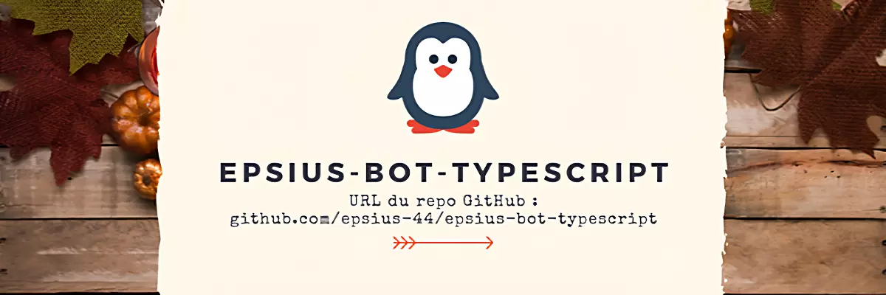

# Epsius-Bot-Typescript

    

Epsius est un bot discord développer pour le serveur Discord PSN-2 EPSI-WIS Nantes (2022-2023).

Mais attention Epsius n'est pas un bot comme les autres !

Suite à diverses expériences scientifiques, un penguin 🐧 avec une conscience vient de créer son compte Discord.

Son passe-temps, rendre des services aux étudiants d'EPSI-WIS Nantes.

## Objectifs

> **Warning**
>
> Documentation en cours de rédaction.